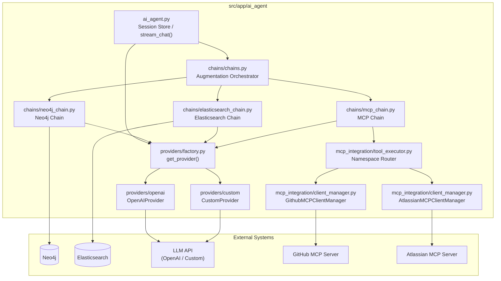
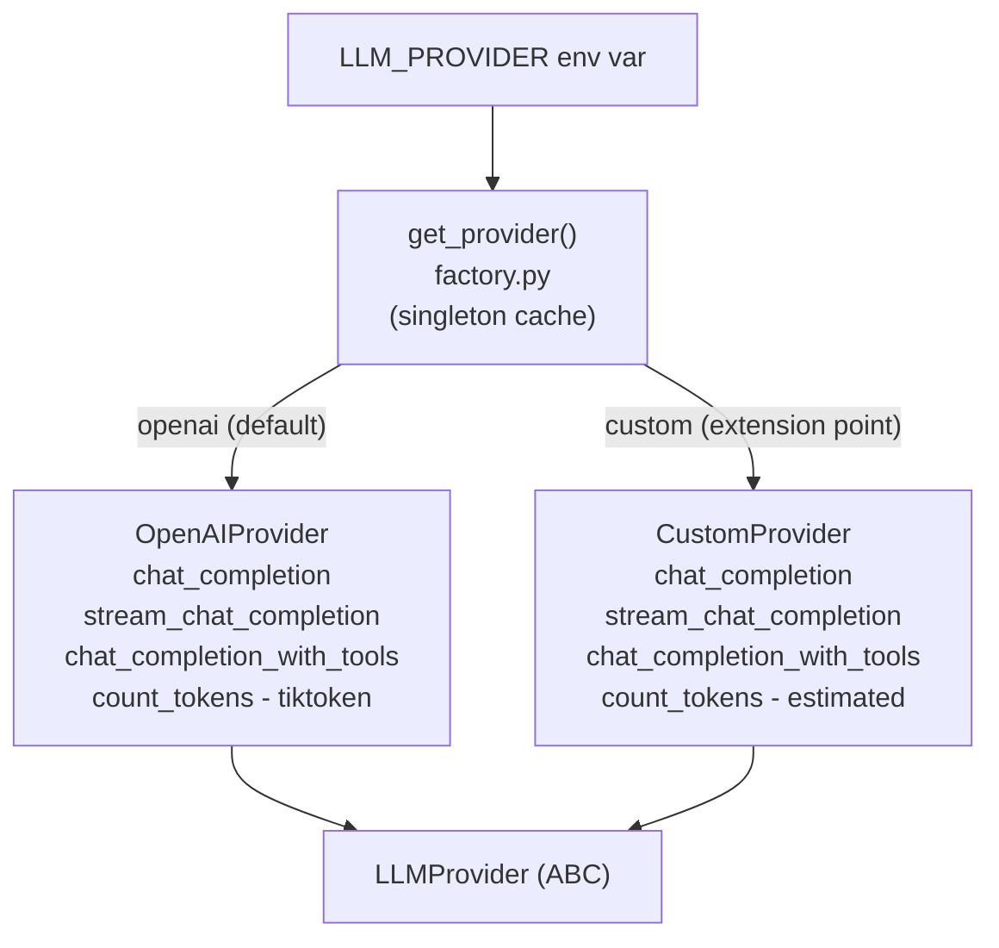
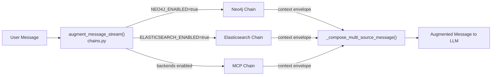
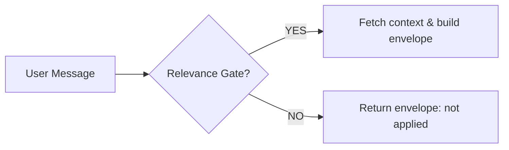
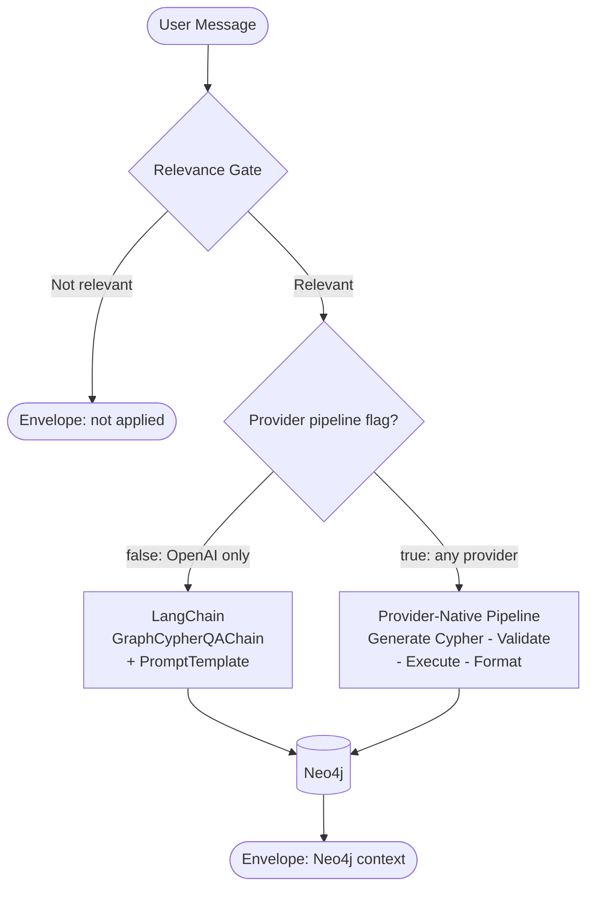
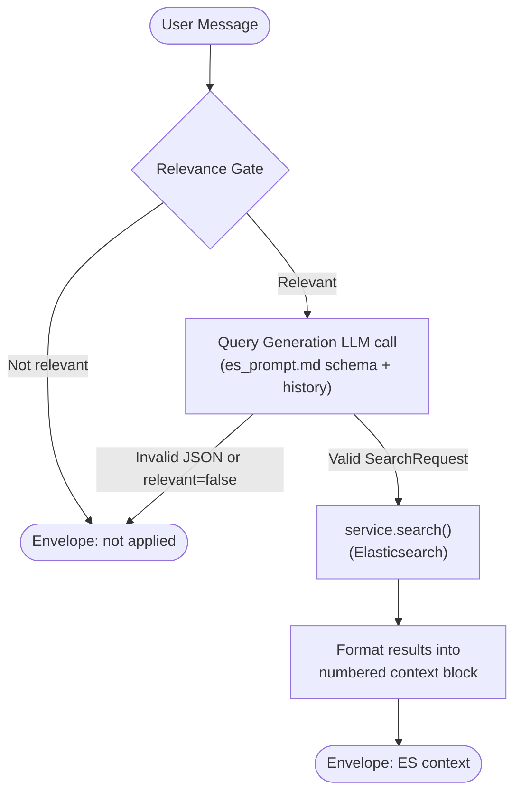
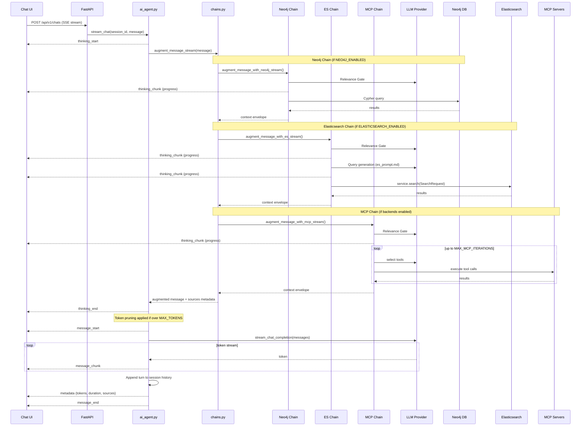
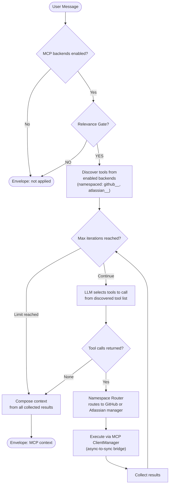

# AI Agent — Design & Workflow

## Overview

Work Behavior Analytics AI provides three primary interfaces: Chat, Search, and interactive Graph visualization. The interactive graph is the central experience; the Chat interface is one entry point into it, and a successful chat response backed by a Neo4j query can surface data that leads directly into graph exploration. The AI agent powers the Chat interface — it accepts a user message, enriches it with context from one or more data sources (graph database, external tools), then streams a token-by-token response from the configured LLM.

The agent lives in `src/app/ai_agent/` and is invoked by the FastAPI chat endpoint as a Server-Sent Events (SSE) stream.

---

## Component Architecture

| Component | Responsibility |
|---|---|
| `ai_agent.py` | Session lifecycle, streaming phases, token pruning |
| `chains/chains.py` | Fan-out to active chains; composes context envelopes into one prompt block |
| `chains/neo4j_chain.py` | Graph database augmentation via Cypher query generation and execution |
| `chains/elasticsearch_chain.py` | Entity search and discovery augmentation via structured ES queries |
| `chains/mcp_chain.py` | External tool augmentation via MCP protocol (multi-iteration tool loop) |
| `providers/factory.py` | Singleton LLM provider factory; OpenAI is supported out of the box; a custom provider extension point is available for users who want to use a different LLM |
| `mcp_integration/tool_executor.py` | Namespace-based routing of tool calls to the correct MCP backend |
| `mcp_integration/client_manager.py` | Async-to-sync bridge for MCP server sessions (GitHub, Atlassian) |

---

## LLM Provider Abstraction

All LLM interactions go through the `LLMProvider` abstract base class. Providers are instantiated once and cached as singletons by the factory. **OpenAI is supported out of the box.** Users who do not want to use OpenAI can implement the `CustomProvider` extension point against any OpenAI-compatible or proprietary LLM API — no changes to the rest of the system are required.

> **Design Decision — LangChain:** LangChain is the out-of-the-box integration layer for the Neo4j chain, using `GraphCypherQAChain` for automatic schema introspection, Cypher generation, and result formatting. It requires the OpenAI provider and is the default path. For deployments where OpenAI cannot be used, the provider-native pipeline (`FF_NEO4J_USE_PROVIDER_PIPELINE=true`) provides an equivalent flow that works with any configured provider.

---

## Augmentation Chains

Before a message reaches the LLM, `augment_message_stream()` in `chains.py` fans it out to each active chain. Each chain independently decides whether the message is relevant (the **Relevance Gate** pattern), fetches context, and returns a **context envelope**. The orchestrator composes all envelopes into a single bounded prompt block.

Chains run **sequentially** in the order: Neo4j → Elasticsearch → MCP. If no chain applies, the original message is passed to the LLM unchanged.

### Relevance Gate Pattern

Each chain opens with an inexpensive yes/no LLM call to decide whether the message warrants augmentation. This avoids injecting irrelevant context on every turn at the cost of one extra LLM round-trip per active chain.

### Neo4j Chain

Translates the user message to Cypher, executes it against the graph database, and returns a natural-language summary as the context envelope. Two query paths exist, controlled by a feature flag.

### Elasticsearch Chain

Fires for **search and discovery** intent — find, list, filter, or look up entities by keyword, name, identifier, status, priority, or date range. It does **not** fire for graph traversal or relationship queries; those are handled by Neo4j.

Two LLM calls are made per request, consistent with the Neo4j and MCP pattern:
1. **Relevance gate** — a cheap focused YES/NO call (no schema context) decides whether to proceed.
2. **Query generation** — the full `es_prompt.md` schema prompt plus conversation history produces a validated `SearchRequest` JSON object. If the LLM cannot build a valid query, the chain returns silently with `applied=False`. **There is no raw-message fallback.**

The generated `SearchRequest` is executed via the existing `service.search()` function with `full=True` to retrieve all indexed attributes. Results are formatted into a numbered list with entity type, source, event time, URL, and truncated attribute values (200-char limit).

**Configuration:**
- `ELASTICSEARCH_ENABLED` — feature flag (default `false`)
- `ES_CHAIN_MAX_RESULTS` — max hits included in the context block (default `5`)
- `AUGMENTATION_HISTORY_TURNS` — prior turns passed to both LLM calls for reference resolution (shared with all chains)

### MCP Chain

Discovers tools from enabled backends (GitHub, Atlassian) and runs a multi-iteration tool-selection and execution loop capped at `MAX_MCP_ITERATIONS`. See [MCP Orchestration Detail](#mcp-orchestration-detail) for the full loop.

---

## Request Flow

---

## MCP Orchestration Detail

The MCP chain manages a dynamic tool-use loop. Tool names are namespaced (`github__`, `atlassian__`) by the namespace router to prevent collisions across backends.

The `GithubMCPClientManager` and `AtlassianMCPClientManager` maintain a synchronous API surface over the async MCP SDK via a thread-based async-to-sync bridge, allowing the chain to call MCP servers without blocking the event loop.

> **Atlassian config:** The Atlassian manager loads its connection config from the application database first (connector settings table), falling back to environment variables (`ATLASSIAN_MCP_*`) if no DB record exists.

---

## Streaming & Events

The agent exposes its full processing pipeline to the client as a Server-Sent Events (SSE) stream divided into two phases. The **augmentation phase** (`thinking_start` → `thinking_chunk` events → `thinking_end`) gives the UI live visibility into context gathering — which chains fired and why. The **generation phase** (`message_start` → `message_chunk` tokens → `message_end`) streams LLM output as it is produced, allowing the UI to begin rendering before generation is complete. A `metadata` event emitted just before `message_end` carries per-response diagnostics (token counts, elapsed time, which chains contributed context).

---

## Future Work

### Persistence & History

- **Persist chat history to the database** — the current in-memory store is lost on restart; sessions cannot be resumed.
- **Multi-turn MCP context** — MCP tool results are discarded after each turn; the LLM loses tool context in follow-up messages. Example: Turn 1 asks "What PRs is Alice working on?" — the MCP chain calls `github__list_pull_requests` and the LLM responds with three PRs. Turn 2 asks "Tell me more about the rate limiting one" — without retained tool context the MCP chain must re-fetch from GitHub from scratch instead of drilling into already-retrieved data.

### UX Enhancements

- **Graph visualization from Cypher responses** — when the Neo4j chain executes a successful query, surface a link or inline panel to visualize the subgraph in the Graph page.
- **PDF conversation export** — generate a formatted PDF summary of the conversation for offline review.

### Architecture

- **Parallel chain execution** — the Neo4j and MCP chains are independent and currently run sequentially; running them concurrently would reduce augmentation latency by roughly half.
- **Adaptive Cypher query generation** — the current pipeline generates one Cypher query per request; the first attempt may not retrieve the right data. A retry or refinement mechanism (e.g. inspect empty or unexpected results and re-prompt the LLM with that feedback to generate a corrected query) would improve answer quality for complex or ambiguous questions.
- **Observability** — add structured per-request tracing (which chains fired, Cypher queries generated, MCP tools called) to aid debugging and performance analysis.
