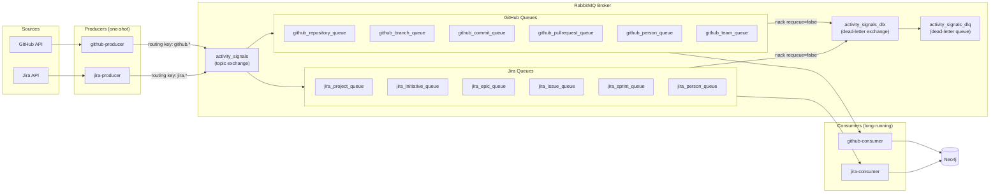
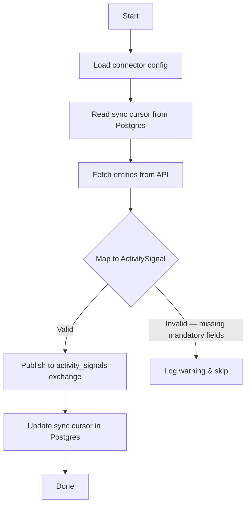
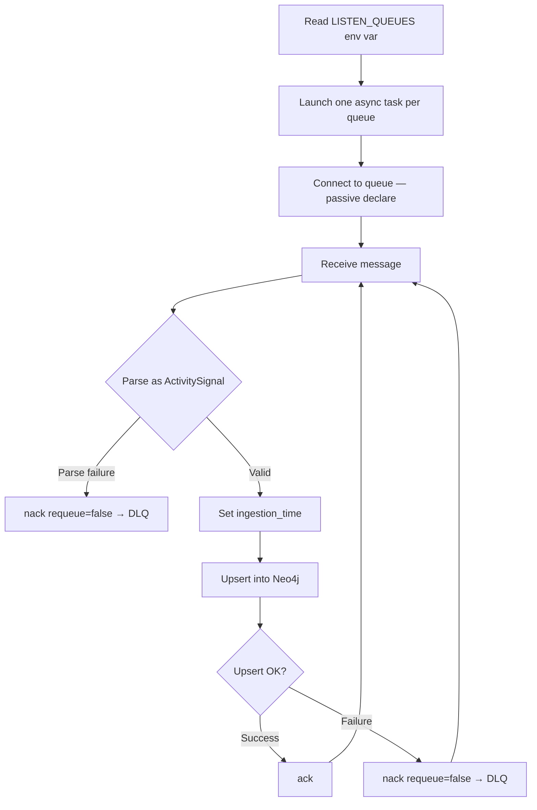

# RabbitMQ Exchange & Queue Design

**Audience:** Developers working on the ActivitySignal ingestion pipeline.

---

## Overview

RabbitMQ is the message broker for the event-driven ingestion pipeline. Producers fetch data from GitHub and Jira APIs, publish `ActivitySignal` events to a topic exchange, and consumers route those events into Neo4j per entity type.

---

## High-Level Architecture



---

## Exchange Topology

| Exchange | Type | Durable | Purpose |
|---|---|---|---|
| `activity_signals` | `topic` | Yes | Main exchange; all producers publish here |
| `activity_signals_dlx` | `direct` | Yes | Dead-letter exchange; receives rejected messages |

- **Initialization:** Declared idempotently at app container startup via `src/app/scripts/init_rabbitmq.py` (run from `entrypoint.sh` before Uvicorn starts).
- **Re-declaration safe:** Running the init script multiple times has no effect if the topology already matches.

---

## Queue Catalog

### GitHub Queues

| Queue | Routing Key | Bound Exchange | DLX |
|---|---|---|---|
| `github_repository_queue` | `github.Repository` | `activity_signals` | `activity_signals_dlx` |
| `github_branch_queue` | `github.Branch` | `activity_signals` | `activity_signals_dlx` |
| `github_commit_queue` | `github.Commit` | `activity_signals` | `activity_signals_dlx` |
| `github_pullrequest_queue` | `github.PullRequest` | `activity_signals` | `activity_signals_dlx` |
| `github_person_queue` | `github.Person` | `activity_signals` | `activity_signals_dlx` |
| `github_team_queue` | `github.Team` | `activity_signals` | `activity_signals_dlx` |

### Jira Queues

| Queue | Routing Key | Bound Exchange | DLX |
|---|---|---|---|
| `jira_project_queue` | `jira.Project` | `activity_signals` | `activity_signals_dlx` |
| `jira_initiative_queue` | `jira.Initiative` | `activity_signals` | `activity_signals_dlx` |
| `jira_epic_queue` | `jira.Epic` | `activity_signals` | `activity_signals_dlx` |
| `jira_issue_queue` | `jira.Issue` | `activity_signals` | `activity_signals_dlx` |
| `jira_sprint_queue` | `jira.Sprint` | `activity_signals` | `activity_signals_dlx` |
| `jira_person_queue` | `jira.Person` | `activity_signals` | `activity_signals_dlx` |

### Dead-Letter Queue

| Queue | Bound Exchange | Routing Key |
|---|---|---|
| `activity_signals_dlq` | `activity_signals_dlx` | `activity_signals_dlq` |

### Queue Properties (all entity queues)

| Property | Value |
|---|---|
| Type | Classic (not Quorum) |
| Durable | `true` |
| `x-dead-letter-exchange` | `activity_signals_dlx` |
| `x-dead-letter-routing-key` | `activity_signals_dlq` |

> **Why Classic over Quorum?** Single-node deployment. `x-delivery-limit` (Quorum-only) is not used; poison-message handling uses consumer-side `nack(requeue=False)` instead.

---

## Routing Key Convention

```
<source>.<EntityType>
```

- Source is lowercase: `github`, `jira`
- EntityType matches the Pydantic discriminator literal: `Repository`, `PullRequest`, `Issue`, etc.
- Binding on the topic exchange uses exact routing key match (not wildcards)

**Examples:**

| Source | Entity | Routing Key |
|---|---|---|
| GitHub | Repository | `github.Repository` |
| GitHub | PullRequest | `github.PullRequest` |
| Jira | Issue | `jira.Issue` |
| Jira | Sprint | `jira.Sprint` |

---

## Message Properties

| Property | Value |
|---|---|
| `delivery_mode` | `PERSISTENT` (2) — survives broker restart |
| `content_type` | `application/json` |
| Body format | UTF-8 encoded JSON of `ActivitySignal` Pydantic model |
| Batching | None — one message per signal |

---

## ActivitySignal Envelope

Key fields carried in every message:

| Field | Set By | Description |
|---|---|---|
| `signal_id` | Producer | UUID; used as correlation ID in logs |
| `source` | Producer | `github` or `jira` |
| `entity_type` | Producer | Discriminator (e.g. `PullRequest`) |
| `external_id` | Producer | Source system ID; MERGE key in Neo4j |
| `event_time` | Producer | `updated_at` / `created_at` from source API |
| `ingestion_time` | Consumer | Timestamp set immediately on receipt |
| `attributes` | Producer | Per-entity typed sub-model |
| `relationships` | Producer | List of `Relationship` objects |

---

## Relationship Types

| Relationship | Emitted By | Direction | Neo4j Pattern |
|---|---|---|---|
| `PART_OF` | GitHub, Jira | `OUT` | `(node)-[:PART_OF]->(target)` |
| `AUTHORED_BY` | GitHub | `None` (undirected) | `-[:AUTHORED_BY]-` |
| `MERGED_INTO` | GitHub | `OUT` | `(node)-[:MERGED_INTO]->(target)` |
| `REVIEWS` | GitHub | `None` (undirected) | `-[:REVIEWS]-` |
| `ASSIGNED_TO` | Jira | `None` (undirected) | `-[:ASSIGNED_TO]-` |

**Direction semantics:**
- `OUT` → directed edge stored as `(node)-[:REL]->(target)`
- `IN` → directed edge stored as `(target)-[:REL]->(node)`
- `None` → stored once as `(node)-[:REL]->(target)`, queried undirected with `-[:REL]-`

---

## Producer Behaviour



- **Execution model:** One-shot; run via `docker compose run --rm github-producer`
- **Sync state:** Stored in Postgres `producer_sync_state` table (`last_synced_at` per repo/project)
- **Producers never read from Neo4j** — strict decoupling from consumers
- **Text truncation:** Large free-text fields (e.g. PR body, commit message) truncated to 2000 chars before publishing

---

## Consumer Behaviour



- **`prefetch_count`:** `1` per queue — sequential processing, no in-flight parallelism per task
- **Consumer declaration:** `passive=True` — consumer does not create queues; init script owns topology
- **Ack policy:** Message is acked only after successful Neo4j write
- **DLQ routing:** Any parse error or upsert failure → `nack(requeue=False)` → `activity_signals_dlq`

---

## Neo4j Idempotency

| Condition | Action |
|---|---|
| `event_time > _last_event_time` on node | Apply property updates |
| `event_time ≤ _last_event_time` on node | Skip property updates (relationships still merged) |
| Target node missing for a relationship | Create stub node: `{id, source, _stub: true}` |
| Full signal arrives for a stub node | MERGE removes `_stub` flag, sets all properties |

- **MERGE key:** `external_id` → stored as `id` on Neo4j nodes
- **Idempotency meta-fields:** `_last_signal_id`, `_last_event_time` stored on every node

---

## Deployment & Scaling

### Service Configuration (docker-compose)

| Service | Type | Restart | `LISTEN_QUEUES` |
|---|---|---|---|
| `github-producer` | One-shot | `"no"` | N/A |
| `jira-producer` | One-shot | `"no"` | N/A |
| `github-consumer` | Long-running | `unless-stopped` | All 6 `github_*` queues |
| `jira-consumer` | Long-running | `unless-stopped` | All 6 `jira_*` queues |

### Running Producers Manually

```
docker compose run --rm github-producer
docker compose run --rm jira-producer
```

### Horizontal Scaling

- Set `GITHUB_CONSUMER_REPLICAS` or `JIRA_CONSUMER_REPLICAS` in `.env`
- RabbitMQ round-robins messages across all running instances automatically
- No code changes required

---

## Observability

- `signal_id` (UUID) is logged at every step: fetch → publish → consume → upsert
- Log fields per message: `signal_id`, `entity_type`, `id`, `queue`
- DLQ (`activity_signals_dlq`) holds all poison messages for inspection
- RabbitMQ Management UI: `http://localhost:15672` (default credentials: `guest/guest`)
- Redrive utility: `src/app/scripts/redrive_dlq.py` — re-publishes DLQ messages to the main exchange after consumer fixes

---

## File Locations

| Concern | File |
|---|---|
| Exchange & queue initialization | `src/app/scripts/init_rabbitmq.py` |
| Publisher / Consumer utilities | `src/common/messaging/rabbitmq.py` |
| ActivitySignal schema | `src/common/activity_signal/models.py` |
| GitHub producer | `src/connectors/producers/github_producer.py` |
| Jira producer | `src/connectors/producers/jira_producer.py` |
| Consumer entry point | `src/connectors/consumers/main.py` |
| Neo4j sink | `src/connectors/consumers/sinks/neo4j_sink.py` |
| DLQ redrive utility | `src/app/scripts/redrive_dlq.py` |
